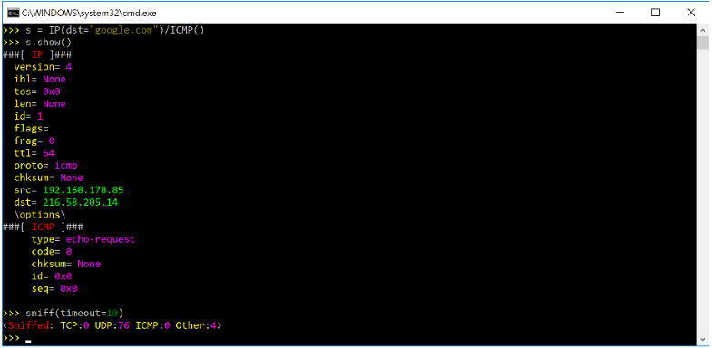
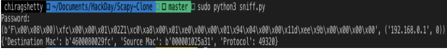
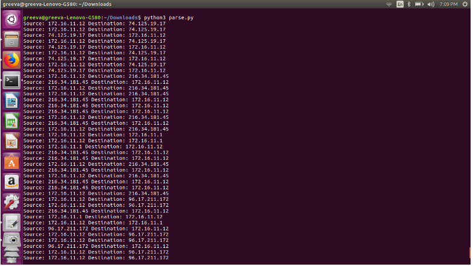
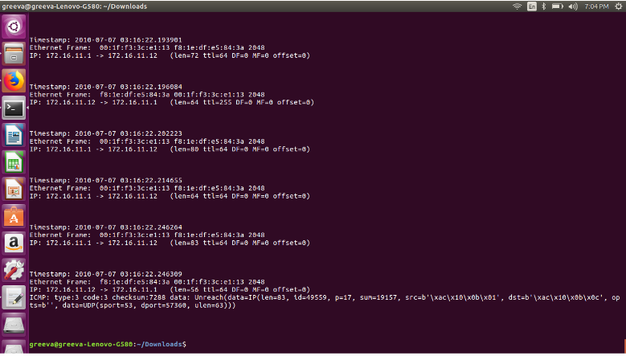
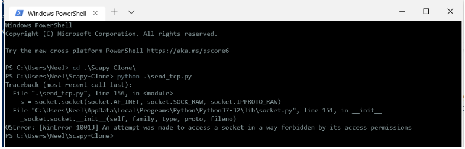
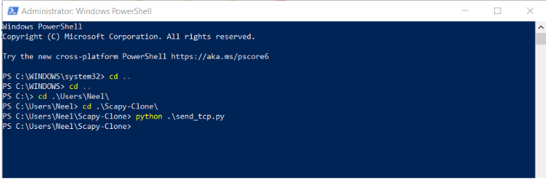
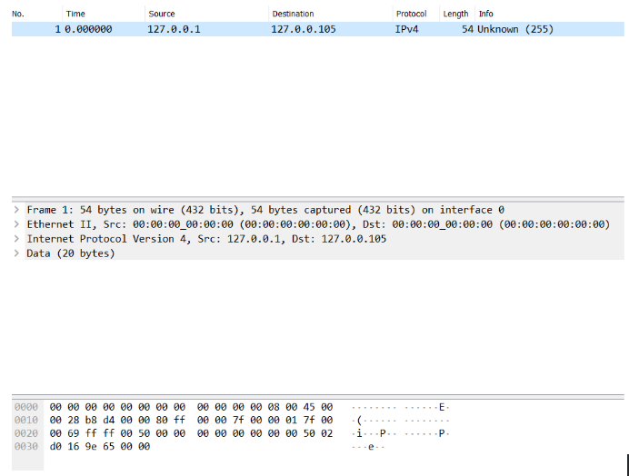

<h1 align="center">Scapy-Clone</h1>
<h3 align="center">An attempt to emulate some functions of scapy</h3>

 
<h3>Introduction</h3>

In one line - Scapy is a Python-based interactive packet manipulation program & library. Supports Python 2 & Python 3. 

Scapy is a powerful Python-based interactive packet manipulation program and library.

It is able to forge or decode packets of a wide number of protocols, send them on the wire, capture them, store or read them using pcap files, match requests and replies, and much more. It is designed to allow fast packet prototyping by using default values that work.

It can easily handle most classical tasks like scanning, tracerouting, probing, unit tests, attacks or network discovery (it can replace hping, 85% of nmap, arpspoof, arp-sk, arping, tcpdump, wireshark, p0f, etc.). It also performs very well at a lot of other specific tasks that most other tools can't handle, like sending invalid frames, injecting your own 802.11 frames, combining techniques (VLAN hopping+ARP cache poisoning, VoIP decoding on WEP protected channel, ...), etc.

<h3>Functions</h3>

The functions for scapy are briefly defined in the introduction. Going into a little bit depth here with regards to packet sniffing. Scapy provides a CLI interface for sniffing packets and shows various attributes like:

###

- Version
- Length
- Flags
- Ttl

<h3 > Screenshots </h3>

 

 

 

 

<h3>Contributors</h3>

###
- [@nilshah98](https://github.com/nilshah98)
- [@greevashah](https://github.com/greevashah)
- [@nurdtechie98](https://github.com/nurdtechie98)
